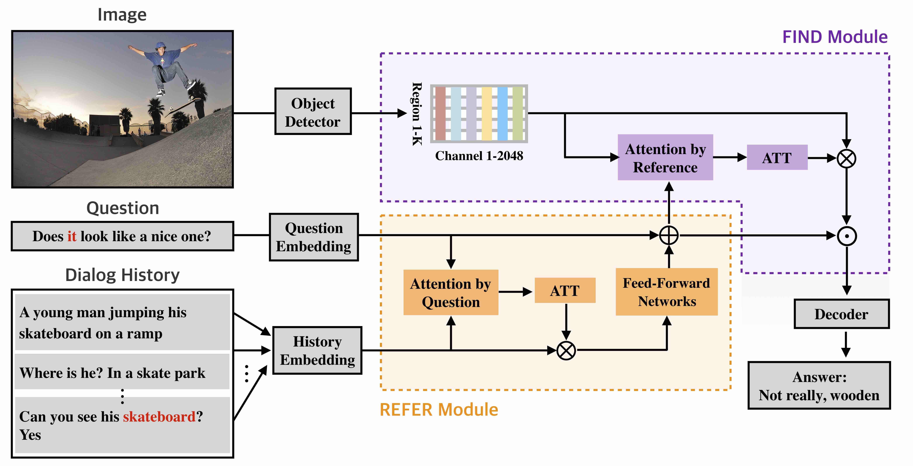

DAN-VisDial
========================================================================

Pytorch Implementation for the paper:

**[Dual Attention Networks for Visual Reference Resolution in Visual Dialog][1]** <br>
[Gi-Cheon Kang](https://gicheonkang.com), [Jaeseo Lim](https://jaeseolim.github.io), and [Byoung-Tak Zhang](https://bi.snu.ac.kr/~btzhang/) <br>
In EMNLP 2019  

<!---->


If you use this code in your published research, please consider citing:
```text
@inproceedings{kang2019dual,
  title={Dual Attention Networks for Visual Reference Resolution in Visual Dialog},
  author={Kang, Gi-Cheon and Lim, Jaeseo and Zhang, Byoung-Tak},
  booktitle={Proceedings of the 2019 Conference on Empirical Methods in Natural Language Processing},
  year={2019}
}
```

Setup and Dependencies
----------------------
This starter code is implemented using **PyTorch v0.3.1** with **CUDA 8 and CuDNN 7**. <br>
It is recommended to set up this source code using Anaconda or Miniconda. <br>

1. Install Anaconda or Miniconda distribution based on **Python 3.6+** from their [downloads' site][2].
2. Clone this repository and create an environment:

```sh
git clone https://github.com/gicheonkang/DAN-VisDial
conda create -n dan_visdial python=3.6

# activate the environment and install all dependencies
conda activate dan_visdial
cd DAN-VisDial/
pip install -r requirements.txt
```

Download Features
----------------------
1. We used the Faster-RCNN pre-trained with Visual Genome as image features. Download the image features below, and put each feature under `$PROJECT_ROOT/data/{SPLIT_NAME}_feature` directory. We need `image_id` to RCNN bounding box index file (`{SPLIT_NAME}_imgid2idx.pkl`) because the number of bounding box per image is not fixed (ranging from 10 to 100).

  * [`train_btmup_f.hdf5`][3]: Bottom-up features of 10 to 100 proposals from images of `train` split (32GB).
  * [`train_imgid2idx.pkl`][4]: `image_id` to bbox index file for `train` split 
  * [`val_btmup_f.hdf5`][5]: Bottom-up features of 10 to 100 proposals from images of `validation` split (0.5GB).
  * [`val_imgid2idx.pkl`][6]: `image_id` to bbox index file for `val` split
  * [`test_btmup_f.hdf5`][7]: Bottom-up features of 10 to 100 proposals from images of `test` split (2GB).
  * [`test_imgid2idx.pkl`][8]: `image_id` to bbox index file for `test` split

2. Download the GloVe pretrained word vectors from [here][9], and keep `glove.6B.300d.txt` under `$PROJECT_ROOT/data/glove` directory.

Data preprocessing & Word embedding initialization
----------------------
```sh
# data preprocessing
cd DAN-VisDial/data/
python prepro.py

# Word embedding vector initialization (GloVe)
cd ../utils
python utils.py
```

Training
--------
Simple run
```sh
python train.py 
```

### Saving model checkpoints  
By default, our model save model checkpoints at every epoch. You can change it by using `-save_step` option. 

### Logging
Logging data `checkpoints/start/time/log.txt` shows epoch, loss, and learning rate.

Evaluation
--------
Evaluation of a trained model checkpoint can be evaluated as follows:
```sh
python evaluate.py -load_path /path/to/.pth -split val
```
Validation scores can be checked in offline setting. But if you want to check the `test split` score, you have to submit a json file to [online evaluation server][10]. You can make json format with `-save_ranks=True` option.

Results
--------
Performance on `v1.0 test-std` (trained on `v1.0` train):

  Model  |  NDCG   |  MRR   |  R@1  | R@5  |  R@10   |  Mean  |
 ------- | ------ | ------ | ------ | ------ | ------ | ------ |
DAN | 0.5759 | 0.6320 | 49.63 |  79.75| 89.35 | 4.30 |

License
--------
MIT License

[1]: https://arxiv.org/abs/1902.09368
[2]: https://conda.io/docs/user-guide/install/download.html
[3]: https://drive.google.com/file/d/1NYlSSikwEAqpJDsNGqOxgc0ZOkpQtom9/view?usp=sharing
[4]: https://drive.google.com/file/d/1QSi0Lr4XKdQ2LdoS1taS6P9IBVAKRntF/view?usp=sharing
[5]: https://drive.google.com/file/d/1NI5TNKKhqm6ggpB2CK4k8yKiYQE3efW6/view?usp=sharing
[6]: https://drive.google.com/file/d/1nTBaLziRIVkKAqFtQ-YIbXew2tYMUOSZ/view?usp=sharing
[7]: https://drive.google.com/file/d/1BXWPV3k-HxlTw_k3-kTV6JhWrdzXsT7W/view?usp=sharing
[8]: https://drive.google.com/file/d/1_32kGhd6wKzQLqfmqJzIHubfZwe9nhFy/view?usp=sharing
[9]: http://nlp.stanford.edu/data/glove.6B.zip 
[10]: https://evalai.cloudcv.org/web/challenges/challenge-page/161/overview
